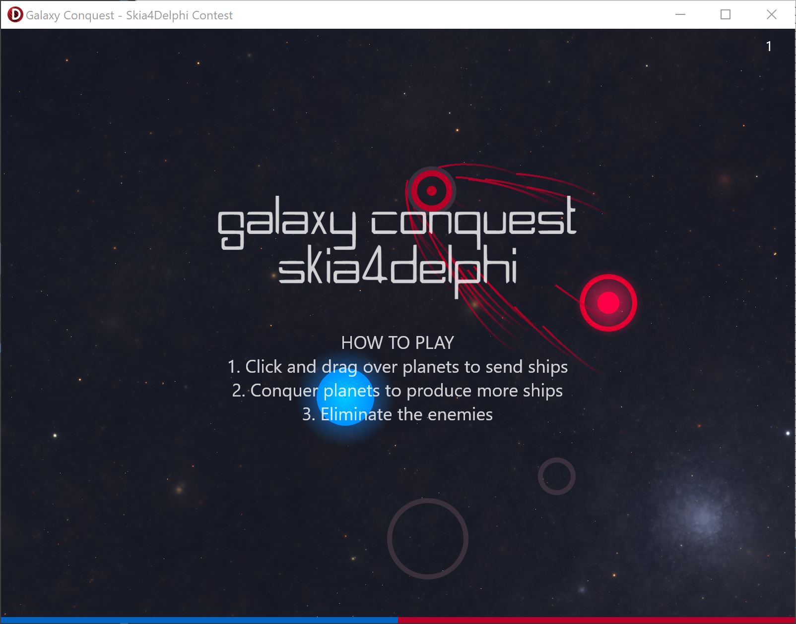

# Galcon4Skia
Galaxy Conquest strategy game using Skia4Delphi

In this real-time strategy game you'll be part of an intergalactic war. Your task is to defeat all the enemies and conquer the planets.

The game uses Firemonkey and Skia4Delphi in order to render the game. For audio Un4Seen Bass library is used.

A short introduction video can be found under the following url:
https://www.youtube.com/watch?v=JJzi5RxxPok

The pixel shader i used can be found here:
https://www.shadertoy.com/view/XlfGRj

The music is from: 
https://modarchive.org/
